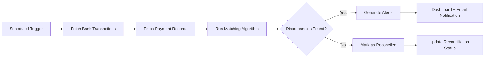
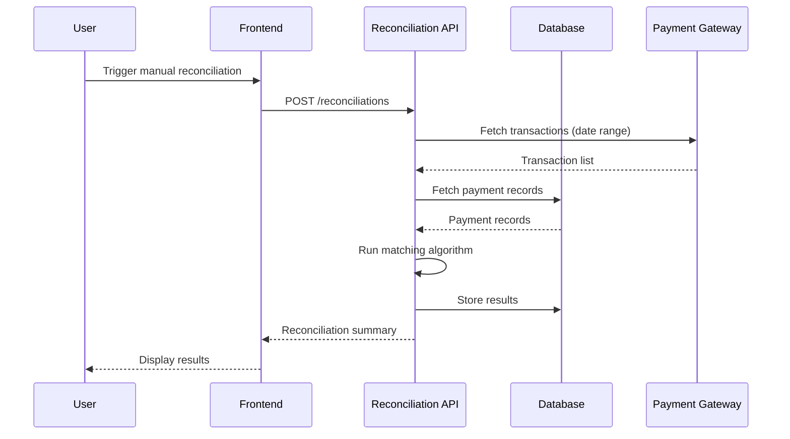
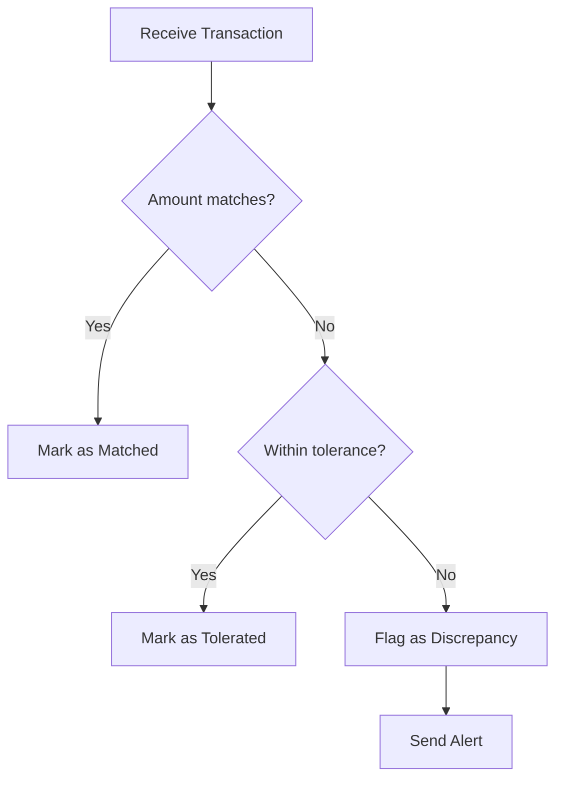
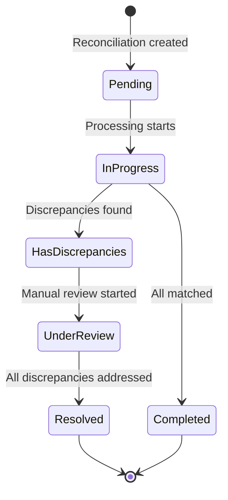
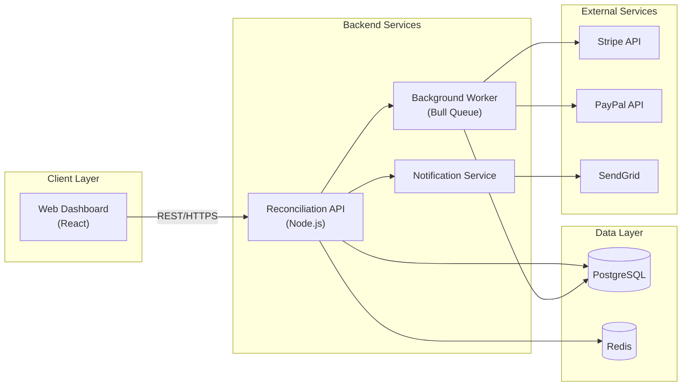
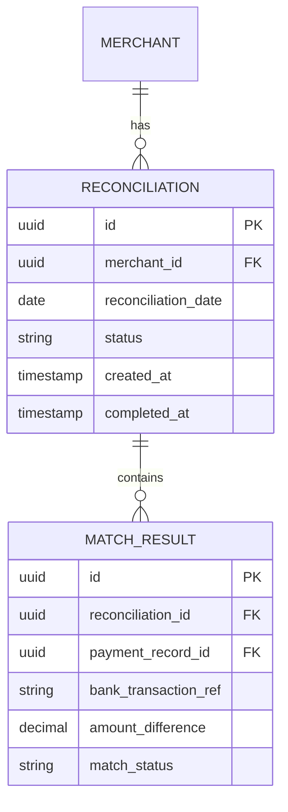
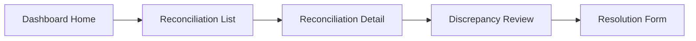

# Technical Design Document — Canonical Template

This is the reference template for generating Technical Design Documents. Each section includes
guidance on what to write and examples. Sections marked *(if applicable)* should be included
when relevant and omitted only when genuinely not applicable.

---

## Header

```
Technical Design Document: [Feature/Product Name]

| Field     | Value                          |
|-----------|--------------------------------|
| Project   | [Project or product name]      |
| Author    | [Name or role of the requester]|
| Date      | [Generation date]              |
| Version   | 1.0 (Draft)                    |
| Status    | Draft                          |
| Reviewers | [TO BE DEFINED]                |
```

---

## 1. Brief Description of the Problem

A concise explanation (3-6 sentences) of:
- What problem exists today for the user or the business
- Why it matters (impact, pain, cost)
- What outcome the solution should achieve

This is NOT a feature description — it's a problem statement. The reader should understand
the "why" before seeing the "how."

**Example:**
> Currently, merchants on the platform must manually reconcile payments at the end of each
> day by cross-referencing bank statements with order records. This process takes 2-3 hours
> daily and is error-prone, leading to an average of 4% undetected discrepancies per month.
> The solution should automate reconciliation and surface discrepancies in real time.

---

## 2. Glossary of Terms *(if applicable)*

Include this section when the domain uses specialized terminology, acronyms, or terms that
could be ambiguous to engineers unfamiliar with the domain.

Format as a table:

| Term | Definition |
|------|-----------|
| **Reconciliation** | The process of matching payment records against bank transactions |
| **Settlement** | The transfer of funds from the payment processor to the merchant's bank |
| **Chargeback** | A reversal of a credit card payment initiated by the cardholder's bank |

Skip this section only if all terminology is universally understood by the target audience.

---

## 3. Scope

### 3.1. In Scope

List specific capabilities, features, or behaviors that this design covers. Be concrete:

- Automatic daily reconciliation of payment records against bank transaction feeds
- Real-time discrepancy detection and alerting via email and dashboard notification
- Manual override for marking discrepancies as resolved with audit trail
- Support for Stripe and PayPal payment processors (Phase 1)

### 3.2. Out of Scope

Explicitly call out what this design does NOT cover, especially items that readers might
reasonably expect to be included:

- Integration with additional payment processors beyond Stripe and PayPal
- Retroactive reconciliation of historical transactions prior to system launch
- Mobile app interface (web dashboard only in this phase)
- Chargeback dispute management workflows

The Out of Scope section prevents scope creep and aligns expectations.

---

## 4. Current Situation *(if a legacy solution or codebase exists)*

Describe the existing system or process being replaced or modified. Include:

- **Current architecture**: What components exist today? How do they interact?
- **Pain points**: What specific technical or UX problems exist?
- **Constraints**: What must be preserved (database schemas, APIs consumed by other teams,
  SLAs)?
- **Diagram** (if helpful): A simplified component or flow diagram of the current state.

If this is a greenfield project with no existing system, omit this section entirely or write
a single line: "This is a greenfield implementation with no existing system."

---

## 5. Proposed Solution

This is the core of the document. It breaks down the technical solution into progressively
more detailed subsections.

---

### 5.1. Key Business Rules

List the rules that govern the system's behavior globally (not specific to one flow). These
are the constraints, policies, and invariants that every part of the system must respect.

Format each rule clearly:

- **BR-01**: A merchant can only have one active reconciliation process at a time. If a new
  reconciliation is triggered while one is in progress, the new request is queued.
- **BR-02**: Discrepancies below $0.50 are automatically marked as "within tolerance" and do
  not generate alerts.
- **BR-03**: All reconciliation results must be retained for 7 years for audit compliance.
- **BR-04**: [TO BE DEFINED] — Threshold for escalating discrepancies to the finance team.

Number them (BR-01, BR-02, ...) so flows can reference them explicitly.

---

### 5.2. General Flow

A high-level overview of how the system works end-to-end. This is the "big picture" before
diving into specific flows. Use a flowchart or sequence diagram to show the main path:



Accompany the diagram with a brief narrative (3-5 sentences) explaining the overall flow.

---

### 5.3. Specific Flows (Epics)

Each logical unit of work gets its own subsection with a stable identifier. Use the format
`E-XXX` (E-001, E-002, ...) so downstream tooling (epic document generators, backlog tools)
can reference each epic unambiguously. Repeat this structure for each flow:

#### 5.3.1. Epic E-001 — [Flow Title]

**Epic ID:** E-001
**Flow Objective:** One sentence explaining what this flow achieves.

**User Type:** Who initiates or interacts with this flow (e.g., End User, Admin, System/Cron,
External Service).

**Participating Systems or Subsystems:**
- Frontend Dashboard (React)
- Reconciliation Service (Backend API)
- Payment Gateway Adapter (Stripe/PayPal)
- Notification Service
- PostgreSQL Database

**Key Business Rules:** BR-01, BR-03 *(reference the rules from section 5.1 that apply)*

**Flow Description:**

Describe the step-by-step process. Be specific about:
- What triggers the flow
- What each system does at each step
- What validations or business rules apply (reference BR-XX)
- What happens on success and on failure
- Error handling and edge cases

**Diagrams:**

Include at least one diagram. Choose the type based on what best explains the flow:

**Sequence Diagram** — for interactions between multiple actors/systems:


**Activity/Flowchart** — for decision-heavy processes:


**State Diagram** — for entity lifecycles:


---

### 5.4. Component Diagram

**This section is always required.** Show the major components of the system and how they
connect. Use `flowchart LR` with subgraphs for logical grouping:



Include a brief description of each component's responsibility below the diagram.

---

### 5.5. Data Model *(if applicable)*

Include when the solution involves new database tables, significant schema changes, or
complex entity relationships.

**ER Diagram:**


**Field details table** (for each entity with non-obvious fields):

| Field | Type | Constraints | Description |
|-------|------|------------|-------------|
| `status` | ENUM | NOT NULL | `pending`, `in_progress`, `completed`, `has_discrepancies` |
| `amount_difference` | DECIMAL(12,2) | NOT NULL | Difference between payment and bank amounts |

Include notes on indexes, partitioning strategies, or migration considerations if relevant.

---

### 5.6. API Design *(if applicable)*

Include when the solution exposes or consumes HTTP APIs. Document the key endpoints:

| Method | Endpoint | Description | Auth |
|--------|----------|-------------|------|
| POST | `/api/v1/reconciliations` | Trigger a new reconciliation | Bearer Token |
| GET | `/api/v1/reconciliations/:id` | Get reconciliation details | Bearer Token |
| GET | `/api/v1/reconciliations/:id/discrepancies` | List discrepancies | Bearer Token |
| PATCH | `/api/v1/discrepancies/:id/resolve` | Mark discrepancy as resolved | Bearer Token |

For critical endpoints, include request/response payload examples:

**POST /api/v1/reconciliations**

Request:
```json
{
  "merchant_id": "uuid",
  "date_from": "2025-01-01",
  "date_to": "2025-01-31",
  "payment_processors": ["stripe", "paypal"]
}
```

Response (201):
```json
{
  "id": "uuid",
  "status": "pending",
  "created_at": "2025-02-01T10:00:00Z"
}
```

Include error response formats if they deviate from the API's standard error pattern.

---

### 5.7. UI/UX Design *(if applicable)*

Include when the solution has a user-facing interface. Describe:

- **Key screens or views**: What pages/modals exist and their purpose
- **User interactions**: What actions can the user take on each screen
- **Information architecture**: How screens relate to each other (navigation flow)
- **Wireframe descriptions**: If no designs exist yet, describe the layout conceptually
- **Design system**: Note which existing components or patterns to reuse

If mockups or Figma links exist, reference them here. If not, a simple flowchart of the
screen navigation is useful:



---

### 5.8. Security Considerations *(if applicable)*

Include when the feature handles sensitive data, authentication, authorization, PII, financial
data, or external-facing APIs.

Cover the relevant items:

- **Authentication**: How users/services authenticate (OAuth2, JWT, API keys, etc.)
- **Authorization**: Role-based or permission-based access control rules
- **Data protection**: Encryption at rest and in transit, PII handling, data masking
- **Input validation**: Sanitization, parameterized queries, rate limiting
- **Audit trail**: What actions are logged and where
- **Compliance**: Relevant standards (PCI-DSS, GDPR, SOC 2, HIPAA)
- **Threat model**: Known attack vectors and mitigations (if relevant)

Don't write a generic security checklist — focus on what's specifically relevant to this feature.

---

### 5.9. Third-Party Integrations *(if applicable)*

Include when the solution depends on external services, APIs, or vendors.

For each integration:

| Aspect | Detail |
|--------|--------|
| **Service** | Stripe Payments API |
| **Purpose** | Fetch transaction records for reconciliation |
| **API Version** | v2023-10-16 |
| **Auth Method** | API Key (server-side only) |
| **Data Exchanged** | Transaction ID, amount, currency, status, timestamp |
| **Rate Limits** | 100 requests/sec (standard tier) |
| **Failure Handling** | Retry with exponential backoff (max 3 attempts), then queue for retry |
| **SLA / Uptime** | 99.99% per Stripe SLA |

Include notes on sandbox/test environments, webhook configurations, and any known limitations.
