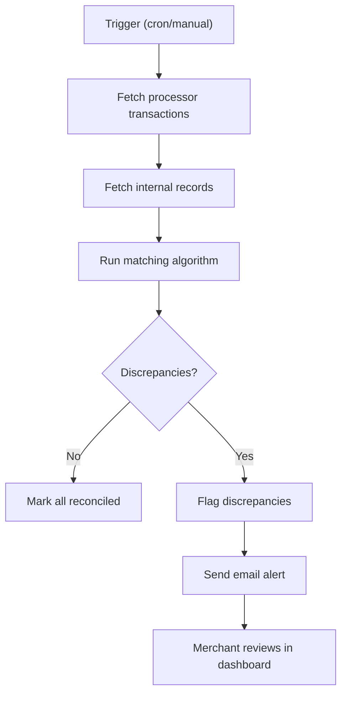

# Epic Document — Canonical Template

This is the reference template for generating Epic documents. Each section includes guidance
on what to write and examples. All sections are mandatory — use `[TO BE DEFINED]` for gaps,
never skip a section.

---

## Document Header

```markdown
# Epic E-<XXX> — <Epic Name> (v<version>)
```

Example: `# Epic E-001 — Automatic Payment Reconciliation (v1.0)`

---

## 0) Snapshot

A quick-reference block for anyone scanning the document. Fill in what's known, mark the
rest as `[TO BE DEFINED]`.

```markdown
## 0) Snapshot

- **Status:** Draft
- **Owner (Lead):** [TO BE DEFINED]
- **Depends on:** [Other epic IDs or external decisions, e.g., "E-002 (Notification Service must exist)", "Infrastructure team to provision queue"]
- **Related docs:** [Links to TDD, domain model, Figma, API specs, related epics]
```

**Status values:** Draft → Ready → In Progress → Done

**Dependencies matter.** If E-003 can't start until E-001 delivers the reconciliation API,
say so explicitly. This drives sprint ordering.

---

## 1) Objective (business outcome)

One paragraph explaining what changes for the user or the business when this epic is
delivered. This is NOT a technical description — it's the "so what?" answer.

```markdown
## 1) Objective (business outcome)

When this epic is delivered, merchants will be able to trigger automatic reconciliation of
their daily payment records against bank transaction feeds. This eliminates the current
2-3 hour manual process, reduces undetected discrepancies from 4% to under 0.5%, and
enables the finance team to close daily books within minutes instead of hours.
```

**Test:** If a non-technical stakeholder reads this paragraph, they should understand the
value without knowing anything about the implementation.

---

## 2) Scope

### In scope
Concrete capabilities this epic delivers. Be specific enough that a developer can tell
whether a feature request falls inside or outside this epic.

### Out of scope
Explicitly exclude things that are adjacent or commonly assumed. This prevents scope creep
during implementation.

### Assumptions
Conditions that must be true for this epic to succeed. If an assumption turns out to be
false, the epic needs re-evaluation. Number them (A1, A2, ...) so they can be referenced
in user stories and technical notes.

```markdown
## 2) Scope

### In scope
- Automatic daily reconciliation triggered by cron job at 02:00 UTC
- Manual reconciliation trigger from the merchant dashboard
- Matching algorithm for Stripe and PayPal transactions
- Discrepancy detection with configurable tolerance threshold
- Email notification when discrepancies are found

### Out of scope
- Support for payment processors beyond Stripe and PayPal (Phase 2)
- Automatic discrepancy resolution (manual review only in this epic)
- Mobile app interface
- Historical reconciliation of pre-launch transactions

### Assumptions
- A1: Stripe and PayPal APIs return transaction data within 24 hours of settlement
- A2: The merchant has already connected their payment processor accounts via existing OAuth flow (E-002)
- A3: Email notification infrastructure (SendGrid) is already provisioned and operational
```

---

## 3) Epic Overview (what it is + why it matters)

Product-level explanation — not implementation details.

### Summary

Explain the epic in plain language. What capability is being added? A product manager
or new team member should understand this without technical background.

```markdown
### Summary

This epic adds automatic payment reconciliation to the merchant dashboard. Each day, the
system pulls transaction records from connected payment processors (Stripe, PayPal) and
matches them against the platform's internal payment records. When amounts match within
the configured tolerance, records are marked as reconciled. When discrepancies are found,
the merchant receives an email alert and can review mismatches in a dedicated dashboard view.
```

### Primary workflow (happy path)

A numbered step-by-step of the main success scenario. Keep it at 5-10 steps. Include
an optional Mermaid diagram if the flow benefits from visualization.

```markdown
### Primary workflow (happy path)

1. Cron job triggers reconciliation at 02:00 UTC (or merchant clicks "Reconcile Now")
2. System fetches bank/processor transactions for the target date range
3. System fetches internal payment records for the same date range
4. Matching algorithm compares each transaction pair by reference ID and amount
5. Matched records are marked as "reconciled"
6. Unmatched records or amount mismatches are flagged as discrepancies
7. If discrepancies exist, merchant receives email notification with summary
8. Merchant reviews discrepancies in dashboard and resolves manually
```

Optional Mermaid diagram:


---

## 4) KPIs and Measurement

Telemetry is in scope from the start. Define what success looks like and how to measure it.

### Primary KPI

The single most important metric for this epic. It should be:
- Quantifiable (a number, percentage, duration)
- Achievable (realistic target for v1)
- Trackable (you can measure it from day 1)

```markdown
### Primary KPI

* **`reconciliation_completion_rate`**
  — Percentage of daily reconciliation runs that complete without errors
  — Initial target: **>= 95%**
```

### Supporting events (defined in stories)

How the primary KPI will be measured — what telemetry events feed into it. Detailed event
specs belong in each user story's "Expected telemetry / logs" field, but list the key
events here for overview.

```markdown
### Supporting events (defined in stories)

- `reconciliation.started` — emitted when a run begins (HU-001.01)
- `reconciliation.completed` — emitted on success with match_count, discrepancy_count (HU-001.03)
- `reconciliation.failed` — emitted on error with error_type, retry_count (HU-001.04)
- `discrepancy.detected` — emitted per discrepancy with amount_diff, processor (HU-001.03)
- `discrepancy.resolved` — emitted when merchant marks a discrepancy as resolved (HU-001.05)
```

### Business rules

Rules that govern this epic's behavior. Reference BR-XX from the TDD when applicable.

```markdown
### Business rules

* BR-01: Only one active reconciliation per merchant at a time (queued if in progress)
* BR-02: Discrepancies below $0.50 are auto-marked as "within tolerance"
* BR-03: Reconciliation results retained for 7 years (audit compliance)
* BR-07: Manual reconciliation limited to 3 triggers per merchant per day
```

### Constraints

Technical or organizational constraints that limit how this epic can be implemented.

```markdown
### Constraints

* Stripe API rate limit: 100 req/sec — batch fetches in pages of 100
* PayPal settlement data has T+1 delay — reconciliation must account for this lag
* Email notifications must use the existing SendGrid template system (no custom HTML)
* All reconciliation data must be encrypted at rest (PCI-DSS requirement)
```

---

## 5) User Stories

Each user story is a concrete, implementable unit of work. Target 1-3 days of developer
effort per story. If a story feels larger, split it.

### Story Format

```markdown
### HU-<epic>.<story> — <Story Title>

**As a** <user type>,
**I want to** <action>,
**So that** <benefit>.

#### Acceptance Criteria

- **AC-01 (Given/When/Then):**
  Given <precondition>,
  When <action>,
  Then <expected result>.

- **AC-02:**
  Given <precondition>,
  When <action>,
  Then <expected result>.

#### Technical Notes

- Implementation approach or architectural guidance
- Relevant API endpoints (from TDD section 5.6)
- Data model entities affected (from TDD section 5.5)
- Business rules that apply: BR-XX
- Assumptions referenced: A1, A2

#### Expected Telemetry / Logs

- `event_name` — when it fires, what payload fields it carries

#### Dependencies

- Depends on: HU-001.01 (must exist before this story can start)
- Blocked by: [external dependency, if any]
```

### Story Writing Guidelines

- **Acceptance criteria use Given/When/Then** — this makes them directly translatable to
  test cases. Be specific: "Given a transaction with amount $100.00 in Stripe and $100.00
  in the platform, When the matching algorithm runs, Then the transaction is marked as
  'reconciled' with amount_difference = 0.00."
- **Technical notes are guidance, not prescriptions.** Point the developer to the right
  components, endpoints, and data model entities, but don't dictate the exact implementation.
  Reference TDD sections by number (e.g., "See TDD §5.6 POST /reconciliations").
- **Every story should be deployable independently** when possible. If story B depends on
  story A, say so in the Dependencies field.
- **Edge cases get their own stories** when they're complex enough. "Handle network timeout
  during Stripe fetch" might be a separate story from the happy-path fetch.
- **Include at least one story for error handling / failure modes** per epic.
- **Include a telemetry story** if the epic has KPIs — someone needs to implement the event
  tracking.

### Example Story

```markdown
### HU-001.01 — Trigger reconciliation via cron job

**As a** system operator,
**I want** the reconciliation process to run automatically at 02:00 UTC daily,
**So that** merchants' records are reconciled without manual intervention.

#### Acceptance Criteria

- **AC-01:** Given the cron job is scheduled for 02:00 UTC, When the time arrives, Then a
  reconciliation run is created for each merchant with status "pending".
- **AC-02:** Given a merchant already has a reconciliation run in "in_progress" status, When
  the cron fires, Then a new run is queued (not started) per BR-01.
- **AC-03:** Given no merchants have connected payment processors, When the cron fires, Then
  no reconciliation runs are created and a warning is logged.

#### Technical Notes

- Use Bull queue for job scheduling (see TDD §5.4 Background Worker)
- Create one job per merchant, processed in parallel with concurrency limit of 10
- Reconciliation date range: previous calendar day (00:00-23:59 UTC)
- References: BR-01 (one active run per merchant)

#### Expected Telemetry / Logs

- `reconciliation.started` — payload: { merchant_id, trigger_type: "cron", date_range }
- `reconciliation.queued` — payload: { merchant_id, reason: "already_in_progress" }

#### Dependencies

- None (this is the entry point for the reconciliation flow)
```

---

## 6) Technical Notes

Epic-level technical context that applies across all stories. This complements (not
duplicates) the TDD — it highlights what's specific to this epic's implementation.

### Architecture Decisions

Decisions made specifically for this epic. Reference the TDD's component diagram and explain
which components this epic touches.

```markdown
### Architecture Decisions

- Reconciliation runs as a background worker (Bull + Redis queue) rather than a synchronous
  API call, because processor API fetches can take 30-60 seconds for large merchants.
- Matching algorithm is stateless — it receives two lists and returns match results. This
  enables easy testing and future replacement.
- Results stored in PostgreSQL with partitioning by merchant_id for query performance.
```

### Data Model Impact

What tables/collections are created or modified by this epic. Reference TDD §5.5.

```markdown
### Data Model Impact

- **New table:** `reconciliations` (id, merchant_id, date_range, status, created_at, completed_at)
- **New table:** `match_results` (id, reconciliation_id, payment_record_id, bank_txn_ref, amount_diff, match_status)
- **Modified table:** `payment_records` — add column `last_reconciled_at` (nullable timestamp)
- Migration: non-breaking, all new columns are nullable or have defaults
```

### API Changes

Endpoints added or modified by this epic. Reference TDD §5.6.

```markdown
### API Changes

- **New:** POST `/api/v1/reconciliations` — trigger manual reconciliation
- **New:** GET `/api/v1/reconciliations/:id` — get run details
- **New:** GET `/api/v1/reconciliations/:id/discrepancies` — list discrepancies
- **New:** PATCH `/api/v1/discrepancies/:id/resolve` — mark as resolved
- No existing endpoints are modified
```

### Risks and Mitigations

Known risks specific to this epic and how they'll be handled.

```markdown
### Risks and Mitigations

| Risk | Impact | Likelihood | Mitigation |
|------|--------|-----------|------------|
| Stripe API rate limiting during peak hours | Reconciliation runs fail or are incomplete | Medium | Implement exponential backoff + retry queue (max 3 attempts) |
| PayPal T+1 settlement delay causes false discrepancies | Merchants see phantom mismatches | High | Exclude transactions less than 36 hours old from matching |
| Large merchants (>10K daily transactions) cause timeouts | Run fails, no reconciliation | Low | Paginate processor API calls, process in batches of 500 |
```

---

## Completeness Guide

When generating stories for an epic, ensure you cover these categories:

1. **Happy path stories** — the main flow working correctly (typically 2-4 stories)
2. **Configuration / setup stories** — any setup the user or system needs (0-2 stories)
3. **Error handling stories** — what happens when things fail (1-3 stories)
4. **Edge case stories** — boundary conditions, concurrent access, empty data (1-2 stories)
5. **Telemetry / observability story** — implementing event tracking for KPIs (1 story)
6. **UI stories** (if applicable) — screens, interactions, feedback states (1-3 stories)

Not every epic will need all categories, but checking against this list prevents gaps.

A typical epic has 5-12 user stories. Fewer than 5 may indicate the epic is too small
(consider merging with another). More than 15 may indicate it should be split into
multiple epics.
